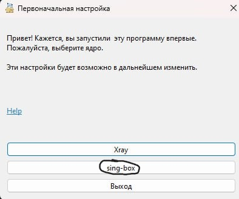
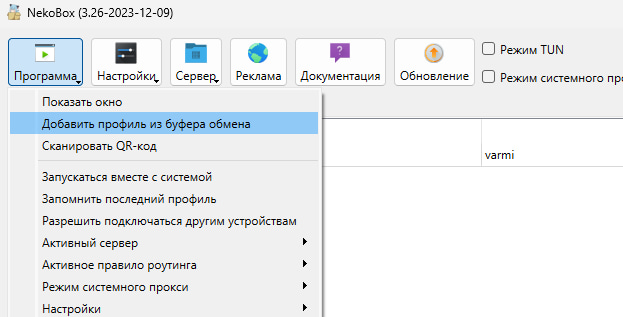
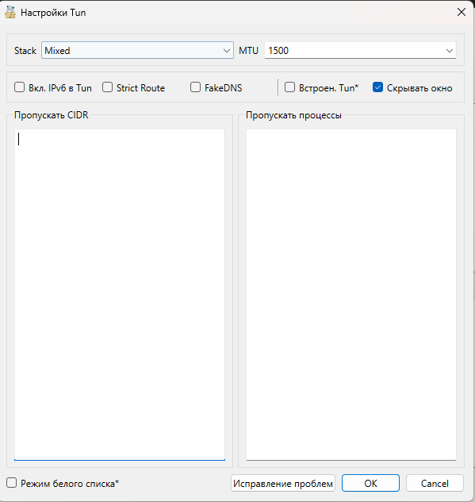
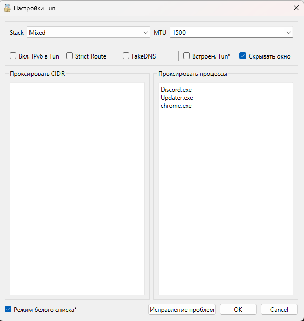

# Nekoray

Before we begin, note that there are two installation options depending on your needs:

- If you only need the proxy to work in a browser, any version of **Nekoray** will do.
- If you need to proxy specific applications, we recommend using versions **3.24** or **3.25**.

This is because in version **3.26**, the "Whitelist Mode" in Tun Mode settings does not work. As a result, you won’t be able to proxy only specific applications.

## 1. Install 

Installing and Configuring Nekoray

Here is a list of all available download links for Nekoray, categorized by operating system:

1. Nekoray for Windows (64-bit)  
=== "Latest"
    [Download Latest](https://github.com/MatsuriDayo/nekoray/releases/latest)
=== "3.26"
    [Download 3.26](https://github.com/MatsuriDayo/nekoray/releases/download/3.26/nekoray-3.26-2023-12-09-windows64.zip)
=== "3.25"
    [Download 3.25](https://github.com/MatsuriDayo/nekoray/releases/download/3.25/nekoray-3.25-2023-11-25-windows64.zip)

2. Nekoray for linux (64-bit, archive)  
=== "Latest"
    [Download Latest](https://github.com/MatsuriDayo/nekoray/releases/latest)
=== "3.26"
    [Download 3.26](https://github.com/MatsuriDayo/nekoray/releases/download/3.26/nekoray-3.26-2023-12-09-linux64.zip)
=== "3.25"
    [Download 3.25](https://github.com/MatsuriDayo/nekoray/releases/download/3.25/nekoray-3.25-2023-11-25-linux64.zip)

3. Nekoray for Linux (AppImage)  
=== "Latest"
    [Download Latest](https://github.com/MatsuriDayo/nekoray/releases/latest)
=== "3.26"
    [Download 3.26](https://github.com/MatsuriDayo/nekoray/releases/download/3.26/nekoray-3.26-2023-12-09-linux-x64.AppImage)
=== "3.25"
    [Download 3.25](https://github.com/MatsuriDayo/nekoray/releases/download/3.25/nekoray-3.25-2023-11-25-linux-x64.AppImage)  

4. Nekoray for Debian/Ubuntu (64-bit, package .deb)  
=== "Latest"
    [Download Latest](https://github.com/MatsuriDayo/nekoray/releases/latest)
=== "3.26"
    [Download 3.26](https://github.com/MatsuriDayo/nekoray/releases/download/3.26/nekoray-3.26-2023-12-09-debian-x64.deb)
=== "3.25"
    [Download 3.25](https://github.com/MatsuriDayo/nekoray/releases/download/3.25/nekoray-3.25-2023-11-25-debian-x64.deb) 

5. Nekoray for Android  
- [Download 1.3.2 arm64-v8a](https://github.com/MatsuriDayo/NekoBoxForAndroid/releases/download/1.3.2/NB4A-1.3.2-arm64-v8a.apk)  
- [Download 1.3.2 armeabi-v7a](https://github.com/MatsuriDayo/NekoBoxForAndroid/releases/download/1.3.2/NB4A-1.3.2-armeabi-v7a.apk)  

## 2. Installing Nekoray on Windows

Next, we will look at the installation process for Nekoray on Windows. Some steps may vary depending on the system, but the overall process remains the same.

Step 1: Download `Nekoray`

Step 2: fter the download is complete, follow these steps:

- Locate the downloaded file: `nekoray-3.26-2023-12-09-windows64.zip`.  

- Right-click on the file and select "Extract All…", or use an archiving tool like WinRAR or 7-Zip to extract the contents to a convenient location on your computer.  

Step 3: Launching the Program

1. Open the folder with the extracted files.
2. Locate the file `nekoray.exe`.
3. Double-click it to launch the program.

The program works out of the box. No installation is required.

## 3. Initial Setup of Nekoray

1. Core Selection:

When you launch the program for the first time, make sure to select the **sing-box** core. 

This is necessary for proper functionality.
If you were not given this choice or selected something other than sing-box, you can check or change it in the settings:

- Click on **Settings**
- General **Settings**
- Navigate to the **Core** tab
- Select `sing-box`.

2. Adding a Profile

1. Copy the profile link for the VPN connection.
2. Paste it into Nekoray using the shortcut Ctrl + V or through the menu:  
- Click on the **Server** button.  
- Select the option **Add Profile from Clipboard**.

Now we have three scenarios:

1. If you only need to proxy the browser. This works for **any version**.

2. If you need everything to be proxied, select "TUN Mode". We’ll go into more detail about configuring this below. This is **only relevant** for version **3.26**.

3. This scenario involves configuring TUN Mode for specific programs. This is **only relevant** for versions **3.24** and **3.25**.

## Scenario 1

**System Proxy mode**

- Right-click on the **profile**.
- Select **Start**.
- At the top, you will see **System Proxy Mode** — *turn it on*.

**Done.**

## Scenario 2

**For 3.26 version**

1. Go to the Settings tab.
2. Open **TUN Mode** Settings.
3. Configure the following:  
- Stack: **Mixed**  
- MTU: **1500** (*you can leave it at 9000, but we recommend 1500*).  
- Mode **TUN**: Turn off.  
- Enable **Whitelist Mode** (*although in version **3.26**, it doesn’t work properly — or at all*).  

**Next:**

- Right-click on the **profile**.
- Select **Start**.
- At the top, you will see **TUN Mode** — turn it on. You will be prompted to restart the program as **an administrator**. **Confirm**.

**Done.**

## Scenario 3:

1. Go to the Settings tab.
2. Open **TUN Mode** Settings.
3. Configure the following:  
- Stack: `Mixed`  
- MTU: `1500` (*you can leave it at 9000, but we recommend setting to 1500*).  
- Mode **TUN**: `Turn off`.  
- Enable `Whitelist Mode`.

Now, in the second column, **Proxy Processes**, enter the processes you want to proxy.

*Example*:  
`Discord.exe`  
`Updater.exe` (for Discord)   
`firefox.exe`    
etc.

**Next:** 

- Right-click on the **profile**.
- Select **Start**.
- At the top, you will see **TUN Mode** — turn it on. You will be prompted to restart the program as **an administrator**. **Confirm**.

**Done.**

## Processes of popular browsers ;

- Google Chrome: `chrome.exe`

- Yandex Browser: `browser.exe`

- Mozilla Firefox: `firefox.exe`

- Microsoft Edge: `msedge.exe`

- Opera Browser: `opera.exe`

- Safari (Windows): `safari.exe`

- Brave Browser: `brave.exe`

## 

> *Source* - [Aéza](https://wiki.aeza.net/universal-virtual-private-network-client-nekoray#pervichnaya-nastroika-nekoray-na-windows)

